# ThesisMind — AI Thesis Companion

Sistem berbasis NLP/LLM untuk membantu mahasiswa menganalisis skripsi menggunakan **Multi-Agent RAG** yang diorkestrasi dengan LangChain, LangGraph, dan LangSmith.

---

## Tujuan Sistem

- Membantu mahasiswa memahami isi skripsi secara otomatis
- Menyediakan analisis multi-aspek (ringkasan, kelemahan, pertanyaan sidang, research gap)
- Menyediakan fitur tanya-jawab interaktif dengan konteks skripsi (RAG)

---

## Fitur

| Fitur | Deskripsi |
|-------|-----------|
| **Multi-Agent Analysis** | 6 agen AI pipeline: ekstraksi info → ringkasan → pertanyaan sidang → kelemahan → research gap → kesimpulan |
| **Chat RAG** | Tanya-jawab interaktif dengan konteks skripsi + citation halaman |
| **Chapter-Aware Retrieval** | Deteksi otomatis bab dari pertanyaan untuk retrieval yang lebih presisi |
| **Validasi Dokumen** | Deteksi otomatis apakah dokumen adalah skripsi (rule-based) |
| **Persistent Storage** | Penyimpanan PDF + FAISS index + riwayat chat (SQLite) |
| **Multi-PDF** | Upload & beralih antar PDF tanpa reproses |

---

## Tech Stack

| Komponen | Teknologi |
|----------|-----------|
| Framework NLP | LangChain 0.2+ |
| Orkestrasi Graph | LangGraph 0.1+ |
| Observability | LangSmith 0.1+ |
| LLM | Google Gemini 2.5 Flash |
| Vector DB | FAISS (faiss-cpu) |
| Embedding | all-MiniLM-L6-v2 (HuggingFace) |
| UI | Streamlit 1.28+ |
| Database | SQLite |

---

## Arsitektur

```
┌───────────────────────────┐
│       STREAMLIT UI        │
│  Upload PDF  │ Tab:Chat   │
│  Sidebar     │ Tab:Analisis
└──────────────┴────────────┘
         │
         ▼
┌───────────────────────────┐
│      PDF PROCESSING       │
├───────────────────────────┤
│ PyPDFLoader               │
│ RecursiveCharTextSplitter │
│ HuggingFace Embeddings    │
└─────────────┬─────────────┘
              │
              ▼
┌───────────────────────────┐
│          FAISS            │
│     Vector Database       │
└───────┬─────────┬─────────┘
        │         │
   (hanya Chat)   │ (tidak dipakai Analisis)
        │         │
        ▼         ▼

┌──────────────────────┐   ┌──────────────────────────┐
│    ANALYSIS TAB      │   │      CHAT TAB            │
│  (LCEL langsung)     │   │  (via LangGraph)          │
├──────────────────────┤   ├──────────────────────────┤
│ information_agent    │   │ router ──► retrieve ──►  │
│ summary_agent        │   │ qa ──► END               │
│ examiner_agent       │   │                          │
│ weakness_agent       │   │ retrieve_node:           │
│ literature_agent     │   │  ├─ chapter-aware?       │
│ conclusion_agent     │   │  │  → filter chunks      │
└──────────┬───────────┘   │  └─ Tidak → FAISS MMR    │
           │               └────────────┬─────────────┘
           │                            │
           └──────────┬─────────────────┘
                      ▼
          ┌─────────────────────┐
          │  Gemini 2.5 Flash   │
          │  (ChatOpenAI)       │
          └──────────┬──────────┘
                     │
                     ▼
          ┌─────────────────────┐
          │     LangSmith       │
          │  Tracing & Logs     │
          └─────────────────────┘
```

### Alur Analisis

```
Upload PDF → hash (MD5) → cek apakah sudah pernah diproses?
  ├─ Ya → load FAISS + teks dari penyimpanan (cache)
  └─ Tidak → load (PyPDFLoader) → split (RecursiveCharacterTextSplitter)
             → embed (HuggingFaceEmbeddings) → FAISS → Validasi Dokumen
             → simpan ke storage (SQLite + filesystem)
→ [Klik Analisis] → Panggil 6 agent secara langsung:
  information → summary → examiner → weakness
  → literature → conclusion → report → tampil di 5 tab
```

> Catatan: Analysis tab memanggil agent secara langsung (bukan via LangGraph) agar progress tiap agent bisa ditampilkan real-time. LangGraph tetap digunakan di **Chat** dan fungsi `run_analysis()` tersedia untuk eksekusi terprogram.

### Alur Chat (via LangGraph)

```
Input pertanyaan → run_chat() → LangGraph:
  router → retrieve → qa → END

Di dalam retrieve_node():
  ├─ Ada bab spesifik? → filter chunks by metadata chapter
  └─ Tidak → FAISS MMR retrieval (k=15, fetch_k=30)
→ qa_agent jawab dengan konteks + riwayat chat + citation halaman
```

---

## Penjelasan LangChain

Digunakan sebagai framework pipeline NLP di seluruh project:

| Komponen | File | Penggunaan |
|----------|------|------------|
| `PromptTemplate` | `prompts/__init__.py` | 7 template prompt untuk setiap agent |
| `ChatOpenAI` | `core/__init__.py:97` | LLM interface ke Gemini 2.5 Flash |
| `PyPDFLoader` | `core/__init__.py:120` | Membaca PDF per halaman |
| `RecursiveCharacterTextSplitter` | `core/__init__.py:135` | Memecah dokumen jadi chunks 1500 char |
| `HuggingFaceEmbeddings` | `core/__init__.py:157` | Embedding teks ke vektor |
| `FAISS` | `core/__init__.py:158` | Vector database untuk similarity search |
| LCEL (`prompt \| llm`) | `agents/__init__.py:18` | Runnable chain setiap agent |

---

## Penjelasan LangGraph

Digunakan untuk mengorkestrasi multi-agent workflow sebagai state graph:

| Komponen | File | Fungsi |
|----------|------|--------|
| `GraphState` | `graph/state.py` | TypedDict dengan 22 key |
| `StateGraph` | `graph/workflow.py:194` | Definisi 10 node + edges |
| Conditional edge | `graph/workflow.py:209` | Routing analyze vs chat |
| `compile()` | `graph/workflow.py:226` | Mengompilasi graph |

Dua jalur utama yang didefinisikan:
- **Analyze**: `router → information → summary → examiner → weakness → literature → conclusion → report → END` (dieksekusi via `run_analysis()`, untuk pemanggilan terprogram)
- **Chat**: `router → retrieve → qa → END` (dieksekusi via `run_chat()`, digunakan di Chat tab)

> Saat ini, Analysis tab memanggil agent secara langsung (bukan via graph) agar progress bar real-time bisa ditampilkan per-agent.

---

## Penjelasan LangSmith

Digunakan untuk tracing dan monitoring seluruh pipeline:

```python
# app.py:6-8
os.environ["LANGSMITH_TRACING"] = "true"
os.environ["LANGSMITH_API_KEY"] = "<api_key>"
os.environ["LANGSMITH_PROJECT"] = "thesismind"
```

Semua LLM call, chain execution, dan graph run otomatis tercatat di dashboard LangSmith untuk debugging dan monitoring performa.

---

## Screenshot Aplikasi

### Halaman Utama

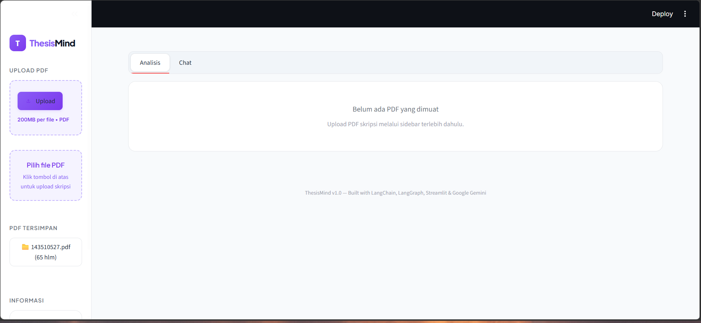

Tampilan utama terdiri dari sidebar kiri untuk upload PDF dan dua tab utama: **Analisis** dan **Chat**.

### Upload & Validasi PDF

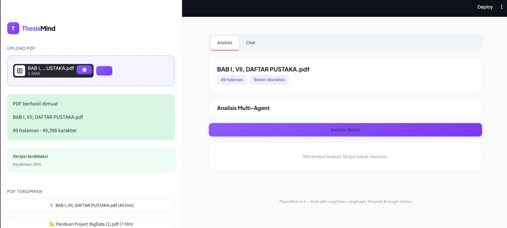

Setelah upload, sistem memproses PDF (load → split → embed → FAISS) dan menampilkan status validasi. Dokumen skripsi akan terdeteksi secara otomatis dengan persentase keyakinan.

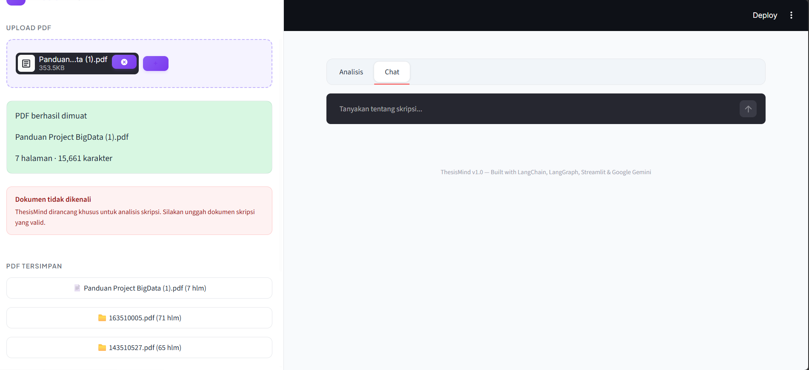

Jika dokumen bukan skripsi (jurnal, makalah, dll), sistem akan menolak dengan status **REJECT** dan pesan peringatan.

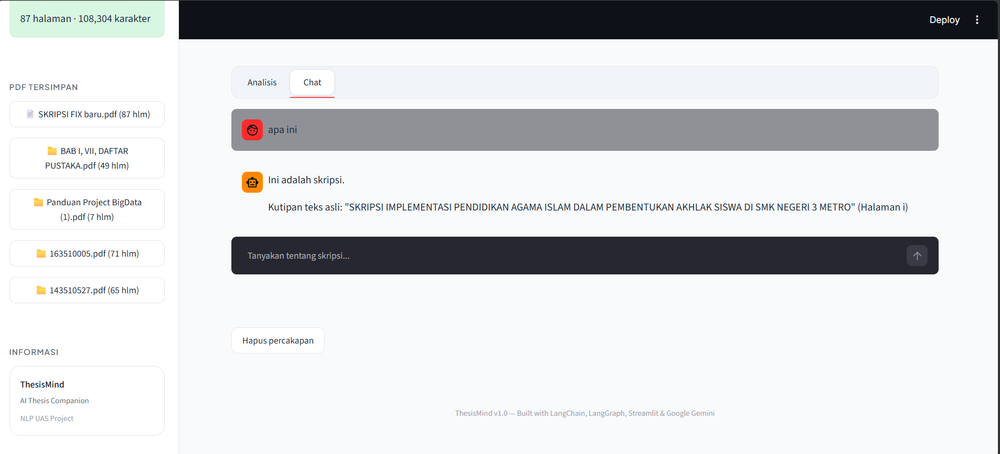

Semua PDF yang pernah diupload tersimpan dan bisa diakses kembali kapan saja tanpa perlu upload ulang.

### Analisis Multi-Agent

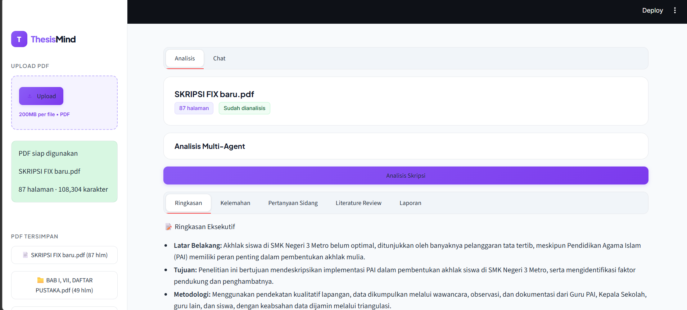

Klik tombol **"Analisis Skripsi"** untuk menjalankan 6 agen AI secara pipeline. Status progress ditampilkan real-time dengan centang hijau/merah.

Hasil analisis ditampilkan dalam 5 sub-tab:

| Tab | Screenshot | Penjelasan |
|-----|------------|------------|
| **Ringkasan** | 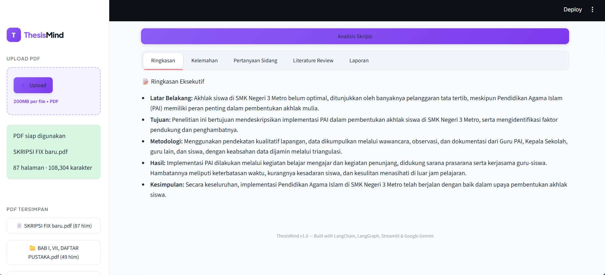 | Eksekutif summary: latar belakang, tujuan, metodologi, hasil, kesimpulan |
| **Kelemahan** | 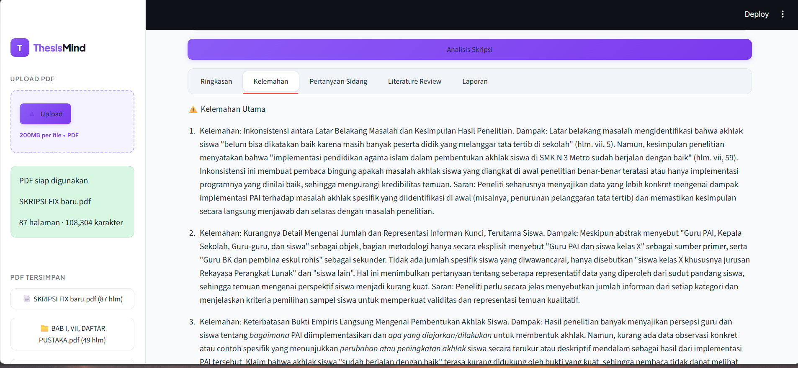 | 5 kelemahan utama penelitian lengkap dengan dampak dan saran perbaikan |
| **Pertanyaan Sidang** | 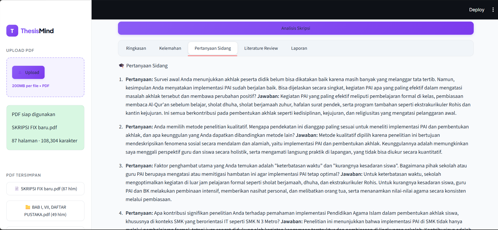 | 5 pertanyaan kritis yang sering diajukan penguji beserta jawaban |
| **Literature Review** | 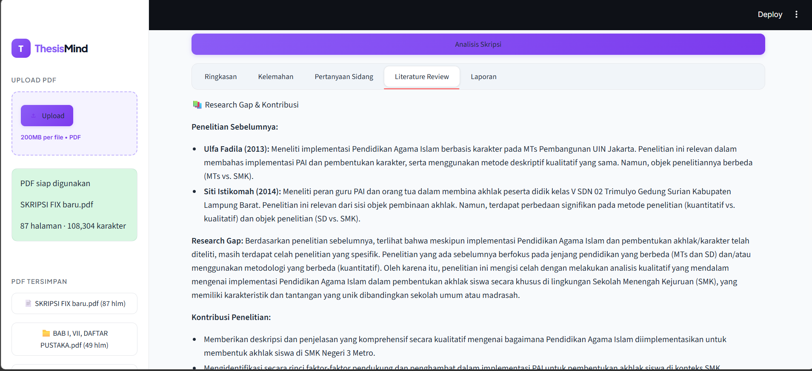 | Analisis research gap, kontribusi penelitian, dan kontribusi praktis |
| **Laporan** | 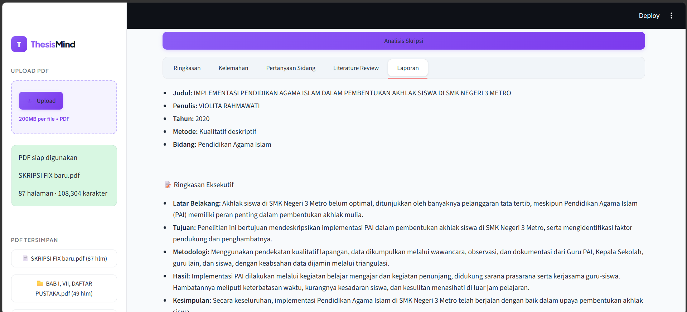 | Laporan lengkap hasil sintesis seluruh agen |

### Chat RAG

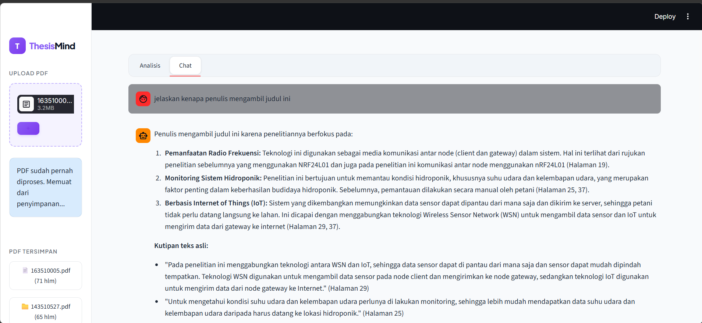

Fitur tanya-jawab interaktif dengan konteks skripsi. Sistem menjawab berdasarkan RAG retrieval dan menyertakan sumber halaman.

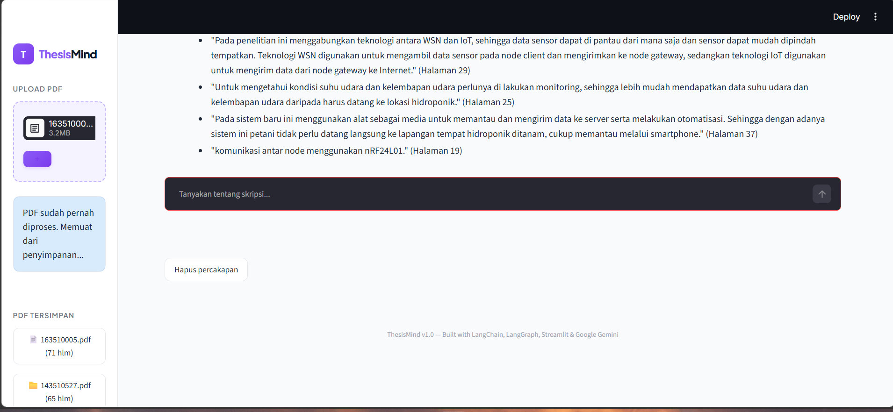

Riwayat chat dapat dihapus dengan tombol **"Hapus percakapan"**.

### LangSmith Trace

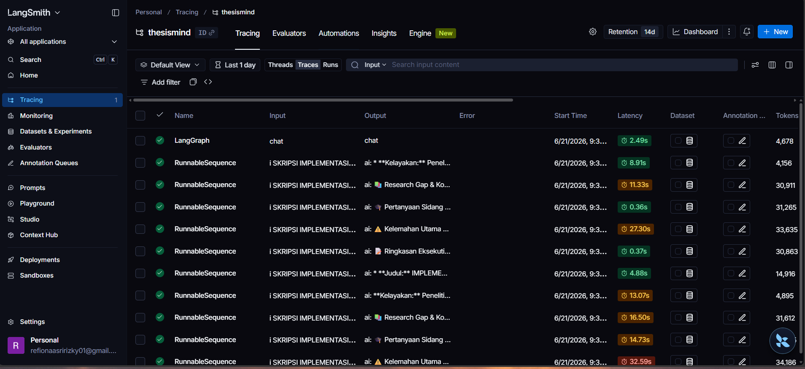

Dashboard LangSmith menampilkan trace setiap eksekusi graph, termasuk LLM call, latency, token usage, dan urutan node yang dijalankan. Berguna untuk debugging dan monitoring performa.

---

## Cara Instalasi

1. Clone repository:
   ```bash
   git clone https://github.com/onnahh-nawh/thesismind.git
   cd thesismind
   ```

2. Install dependencies:
   ```bash
   pip install -r requirements.txt
   ```

3. Buat file `.env`:
   ```env
   GEMINI_API_KEY=your_key_here
   BASE_URL_API=your_endpoint_here
   LANGSMITH_API_KEY=your_langsmith_key
   LANGSMITH_TRACING=true
   LANGSMITH_PROJECT=thesismind
   ```

---

## Cara Menjalankan

```bash
streamlit run app.py
```

Buka `http://localhost:8501` di browser.

---

## Struktur Folder

```
thesismind/
├── app.py                  # Entry point Streamlit
├── requirements.txt        # Dependencies
├── .env                    # API keys
├── screenshots/            # Screenshot images
├── agents/
│   └── __init__.py         # 7 agent functions (LCEL)
├── core/
│   ├── __init__.py         # PDF processing, embedding, vectorstore
│   ├── storage.py          # SQLite + FAISS persistence
│   └── validation.py       # Rule-based document validator
├── graph/
│   ├── __init__.py         # Export run_analysis, run_chat
│   ├── state.py            # GraphState TypedDict
│   └── workflow.py         # LangGraph graph definition
├── prompts/
│   └── __init__.py         # 7 PromptTemplate definitions
└── ui/
    ├── __init__.py         # Export render functions
    ├── sidebar.py          # PDF upload & storage UI
    ├── analysis_tab.py     # Analysis results UI
    └── chat_tab.py         # Chat interface UI
```

---

## Panduan Penggunaan

### 1. Upload PDF
- Buka sidebar → klik upload → pilih file PDF skripsi
- Tunggu proses loading (load → split → embed → FAISS)
- Sistem menampilkan status validasi (VALID/WARNING/REJECT)

### 2. Analisis Skripsi
- Buka tab **Analisis** → klik **"Analisis Skripsi"**
- Tunggu 6 agent selesai (ditandai ✅)
- Lihat hasil di 5 sub-tab: Ringkasan, Kelemahan, Pertanyaan Sidang, Literature Review, Laporan

### 3. Chat Dengan Skripsi
- Buka tab **Chat**
- Ketik pertanyaan di kolom chat
- Sistem menjawab berdasarkan konteks skripsi + sumber halaman

### 4. Manajemen PDF
- PDF tersimpan muncul di sidebar → klik untuk beralih
- Klik **"Hapus percakapan"** untuk membersihkan riwayat chat

---

## Hasil Pengujian

### Analisis Skripsi

| Aspek | Hasil |
|-------|-------|
| Ekstraksi informasi (judul, penulis, metode) | Berhasil |
| Ringkasan eksekutif 5 poin | Berhasil |
| 5 pertanyaan sidang + jawaban | Berhasil |
| 5 kelemahan + dampak + saran | Berhasil |
| Research gap & kontribusi | Berhasil |
| Kesimpulan akhir (sintesis semua agent) | Berhasil |

### Chat RAG

| Skenario | Hasil |
|----------|-------|
| Pertanyaan umum | Relevan dengan konteks |
| Pertanyaan spesifik bab | Chapter-aware retrieval bekerja |
| Pertanyaan lanjutan | Konteks 6 history terakhir terjaga |
| Citation halaman | Disertakan dalam jawaban |

### Performa

| Metrik | Waktu |
|--------|-------|
| Proses PDF 100 halaman | ~20 detik |
| Analisis 6 agent | ~1-3 menit |
| Chat response | ~3-10 detik |
